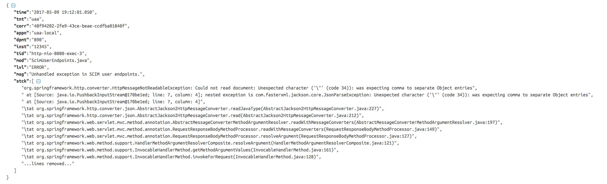

Utility filter for tracing, log enrichment and auditing.

# What does this filter do ?
## 1. Populate HTTP headers for [tracing](opentracing.io)
This filter initializes an HTTP header(X-B3-TraceID) for tracing, if not already present. The header is also added in the outgoing response.
* Note that if you are already using another library for propogating headers, this will have no effect.

## 2. Provides log4j 1 layout for Predix log format
This layout formats the log in JSON and includes the cloudfoundry VCAP info listed in the section above.
Sample log message:


* Enrich SLF4J [MDC](https://logback.qos.ch/manual/mdc.html) with tracing and cloudfoundry VCAP info
   * The log filter adds the following VCAP information to the MDC. 
   * This is used by the PredixLayout for adding this information in the log. See 
```
    APP_ID
    APP_NAME
    INSTANCE_ID
```
    * It also adds the following from HTTP headers:
```
    X-B3-TraceId
    Zone-Id
```

## 3. Auditing
Optionally, this filter can also be used to generate audit events which includes the request and response payload.

# How to use it ?
* Dependency
```xml
        <dependency>
            <groupId>com.ge.predix</groupId>
            <artifactId>spring-log-filter</artifactId>
            <version>${spring-log-filter.version}</version>
            <exclusions>
                <exclusion>
                    <groupId>org.slf4j</groupId>
                    <artifactId>slf4j-log4j12</artifactId>
                </exclusion>
            </exclusions>
        </dependency>
```
* Configure Bean to specify zone extraction
```xml
    <bean id="logFilter" class="com.ge.predix.log.filter.LogFilter">
       <constructor-arg>
            <set value-type="java.lang.String">
                <value>${BASE_DOMAIN:localhost}</value>
            </set>
        </constructor-arg>
        <constructor-arg>
            <set value-type="java.lang.String">
                <value>Predix-Zone-Id</value>
            </set>
        </constructor-arg>
        <constructor-arg value="DEFAULT_ZONE_NAME" />
    </bean>
```

* Configure log4j.properties to use PredixLayout
Reference the PredixLayout for desired appenders.
```
log4j.appender.CONSOLE.layout=com.ge.predix.log4j1.PredixLayout
```

* If you are using Auditing
  * Wire an [AuditEventProcessor](src/main/java/com/ge/predix/audit/AuditEventProcessor.java) bean to 
[LogFilter](src/main/java/com/ge/predix/log/filter/LogFilter.java), to receive AuditEvent for each request.

# Build
```
mvn clean package
```

# Run Integration Tests
```
mvn clean verify
```

# LICENSE
This project is licensed under Apache v2.
